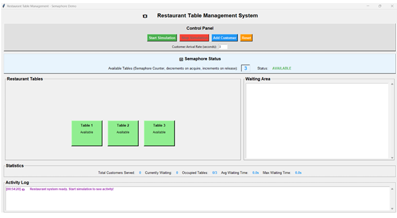

# Operating System Project - Restaurant Table Management System: Semaphore Synchronization 🍝🧵🔒

## 1. Project Overview & Problem Statement
In multi-threaded software architectures, concurrent processes competing for shared, finite physical resources inevitably trigger critical bugs like race conditions, data corruption, or deadlock loops if left unmanaged. This project addresses this **Concurrency Synchronization Problem** by designing and developing a simulated **Restaurant Table Management System**.

The platform models operational layers within a busy dining environment where independent, asynchronous customer threads compete simultaneously for a limited set of dining assets (tables, servers, and order queues). To enforce perfect memory safety and operational logic, the system uses binary and counting **Semaphores** to control entry into critical code blocks, ensuring thread-safe operations even under heavy, concurrent simulation loads.

---

## 2. Core Synchronization Architecture & Technical Specs

The simulation engine is built using **Python and its native `threading` library**, mapping real-world restaurant queues onto low-level concurrency controls:
* **Counting Semaphores (`threading.Semaphore`):** Controls access to the fixed pool of dining tables. When all tables are occupied, additional incoming customer threads are blocked and placed into a safe waiting queue until an active thread releases its lock.
* **Mutex Locks / Binary Semaphores (`threading.Lock`):** Secures shared global states—such as tracking variables for transaction processing records, billing logs, and total restaurant revenue calculations—preventing simultaneous modification risks.
* **Condition Variables (`threading.Condition`):** Handles inter-thread signaling to synchronize customer resource requests directly with active waiter fulfillment worker loops.

---

## 3. Dynamic Visual Interface & Simulation Logs

*Figure 1: Restaurant Table Management System Simulation Interface*

**Explanation:** The engine includes a visual graphical log dashboard to monitor thread statuses and scheduling behaviors in real-time. This user interface provides an active look at how background locks handle threads as they transition from idle waiting loops to active resource usage.

---

## 4. Technical Reflection

### What I Learned
* Writing a multithreaded simulation highlighted the difference between pure parallel computing concepts and actual synchronization challenges. Watching consumer threads pause and wake up in a controlled sequence showed how semaphores manage system safety.
* Seeing how global data records corrupt without locking mechanisms reinforced the importance of guarding critical sections. Implementing strict mutex locks showed me how to protect data channels from multi-threaded corruption.
* Connecting our backend threading processes to a live graphical engine made tracing thread lifecycles intuitive, making it easy to see exactly when threads wait, obtain locks, or release system resources.

### Areas for Improvement
*  As resource dependencies increase, manually coordinating locks grows complex. I want to incorporate structured lock hierarchies or time-out metrics to ensure the system is protected against unexpected deadlock states.
*  I plan to run thread saturation tests to evaluate synchronization latency. Measuring these overhead metrics will help me find ways to optimize lock times, balancing safety with fast processing speeds under high transactional volumes.
